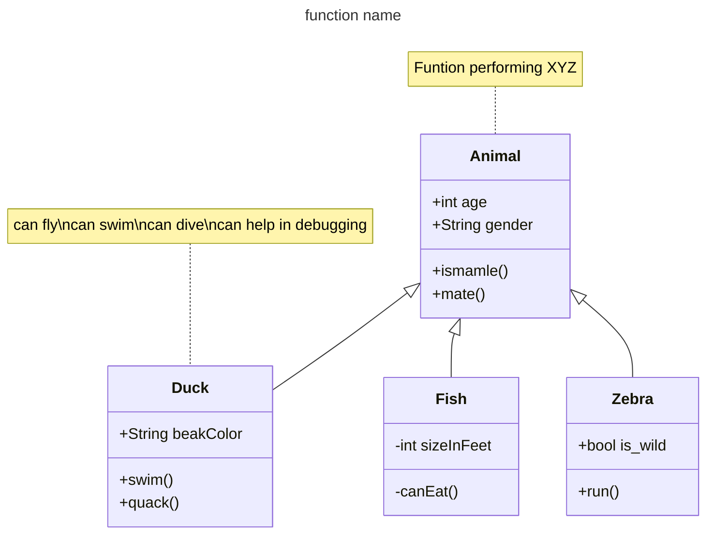

## XYZ component

```mermaid
---
title: function name
---
classDiagram
    note for Animal "Funtion performing XYZ"
    class Animal{
        +int age
        +String gender
        +ismamle()
        +mate()
    }

    Animal <|-- Duck
    note for Duck "can fly\ncan swim\ncan dive\ncan help in debugging"
    Animal <|-- Fish
    Animal <|-- Zebra

    class Duck{
        +String beakColor
        +swim()
        +quack()
    }
    class Fish{
        -int sizeInFeet
        -canEat()
    }
    class Zebra{
        +bool is_wild
        +run()
    }

```

## ABC Component

```mermaid
---
title: function name
---
classDiagram
    note for Animal "Funtion performing XYZ"
    class Animal{
        +int age
        +String gender
        +ismamle()
        +mate()
    }

    Animal <|-- Duck
    note for Duck "can fly\ncan swim\ncan dive\ncan help in debugging"
    Animal <|-- Fish
    Animal <|-- Zebra

    class Duck{
        +String beakColor
        +swim()
        +quack()
    }
    class Fish{
        -int sizeInFeet
        -canEat()
    }
    class Zebra{
        +bool is_wild
        +run()
    }

```
